  

  # ⚡ LuwengSense Reborn
  **100% Native Systemless Hardware Optimization Engine & Interactive WebUI Dashboard**

  
  
  

> [!IMPORTANT]
> ### 🚀 Central Download Center
> All official flashable module ZIP packages, version changelogs, and release assets are centralized in our single distribution hub:
> 👉 **[Download LuwengSense Module on Luweng-Releases](https://github.com/KepalaLuweng/Luweng-Releases#-luwengsense-reborn)**

---

## ⚡ Overview & System Architecture

**LuwengSense Reborn** is an advanced, 100% native systemless hardware performance and thermal optimization engine paired with a cyberpunk-styled real-time WebUI control dashboard. 

Engineered for zero-overhead background operation, **Reborn** eliminates all meta-module dependencies and delivers instant hardware scaling across **KernelSU, ReSukiSU, APatch, and Magisk**.

---

## 🌟 Key Features

* **Cyberpunk WebUI Control Dashboard:** Real-time hardware telemetry displaying live CPU cluster frequencies, active governor states, active profiles, and memory utilization directly within your root manager or web browser.
* **Instant Dynamic Profiles:** Seamlessly switch between four calibrated hardware operational profiles in a single tap:
  * 🌿 **Eco Saver:** Power-efficient CPU frequency limiting and aggressive thermal moderation for extended battery life.
  * ⚖️ **Normal (Balanced):** Dynamic load-aware scaling designed for smooth daily multitasking.
  * 🚀 **Gaming:** Maximizes GPU and big-cluster CPU responsiveness, locks frame pacing, and prioritizes gaming render threads.
  * 🔥 **Extreme:** Unconstrained hardware throughput and maximum governor scaling for intensive benchmarking.
* **Automated DNS & Network Management:** Built-in dynamic DNS switcher with preset low-latency and security profiles.
* **Hardware Ecosystem Synergy:** Detects and establishes an exclusive direct handshake with **LuwengKernel Reborn**, synchronizing low-latency TCP disciplines (BBR / FQ-CoDel), virtual memory swappiness, and microsecond CPU scheduling.
* **100% Native Systemless:** Modifies zero files on your physical `/system` partition, ensuring completely safe installation, easy updates, and clean uninstallation.

---

## 🧠 Universal Compatibility Engine

Built with an intelligent tiered fallback mechanism supporting **Universal Android 8.0 through Android 16**:

* **Tier 1 (Flagship Synergy):** Full hardware-level synchronization when paired with **LuwengKernel Reborn**.
* **Tier 2 (Universal Adaptive):** Automatically detects and optimizes governors across all modern Android SoCs (Snapdragon, MediaTek, Exynos, Google Tensor).
* **Tier 3 (Safe Fallback):** Resilient systemless fallback ensuring rock-solid stability across stock firmware and custom ROMs (AOSP, LineageOS, PixelOS, HyperOS, OneUI, ColorOS).

---

## 📲 Installation

1. Visit the central download center: **[Luweng-Releases](https://github.com/KepalaLuweng/Luweng-Releases#-luwengsense-reborn)**.
2. Download the latest `LuwengSense.Reborn.zip` package.
3. Open your Root Manager (**KernelSU**, **ReSukiSU**, **APatch**, or **Magisk**).
4. Navigate to the **Modules** section and tap **Install from storage**.
5. Select `LuwengSense.Reborn.zip` and confirm installation.
6. Reboot your device to initialize background services.
7. Open the WebUI dashboard from the module **Action** button or via browser.

---

## 🌐 Community & Links

* **Telegram Official Channel:** [t.me/luwengtechofficial](https://t.me/luwengtechofficial)
* **YouTube Tech Channel:** [youtube.com/@LuwengTechID](https://youtube.com/@LuwengTechID)
* **Developer Profile:** [github.com/KepalaLuweng](https://github.com/KepalaLuweng)
